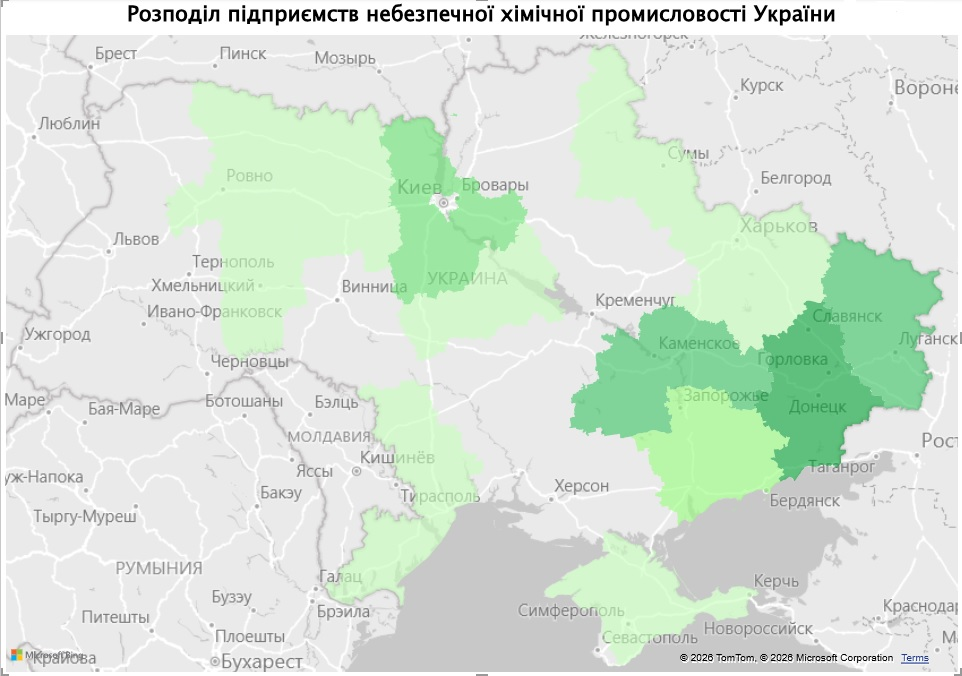
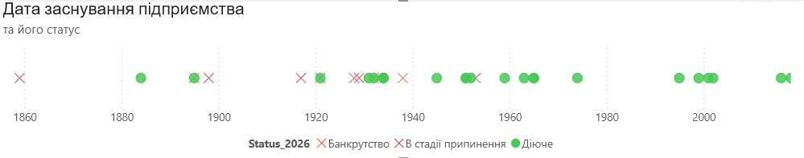
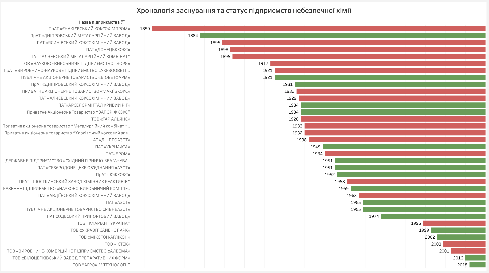
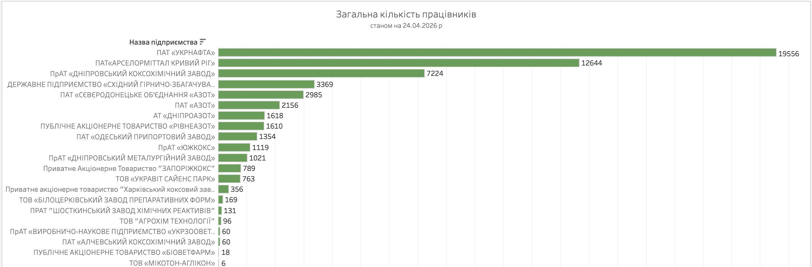
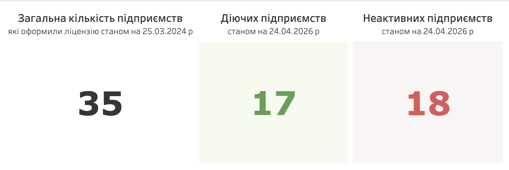
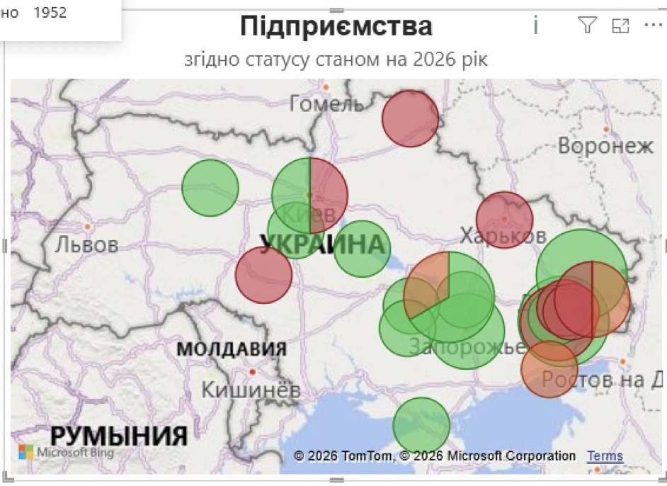
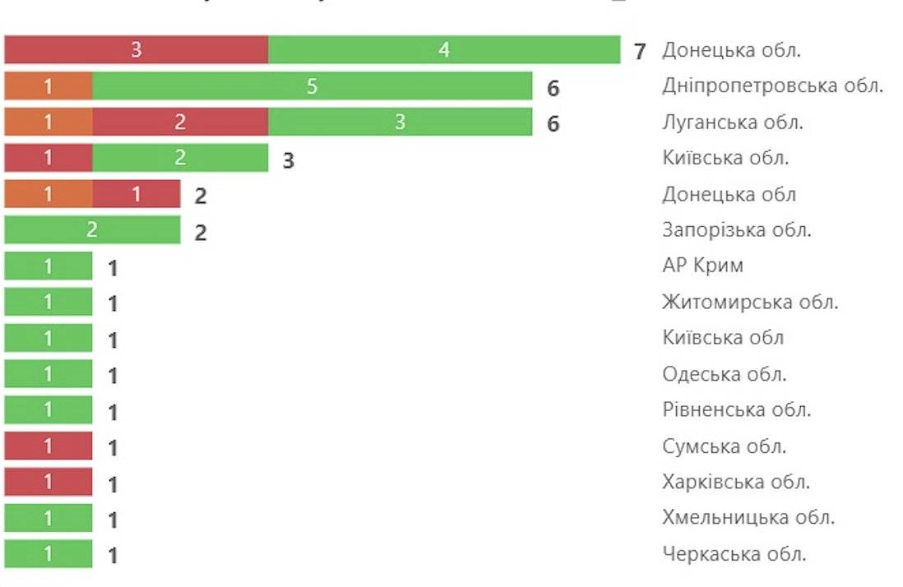
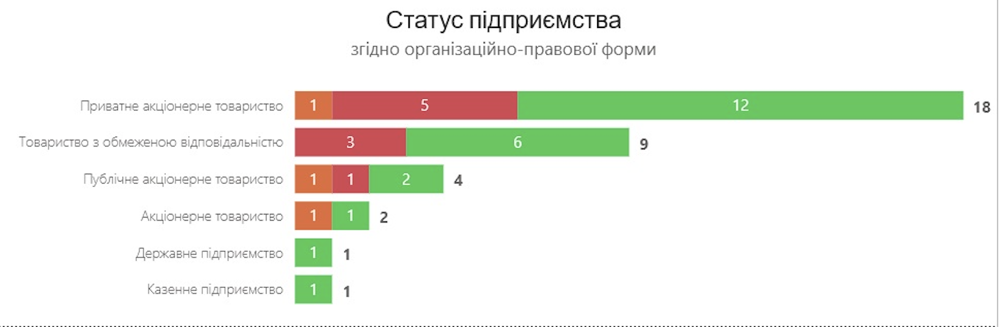

# Небезпечна хімія: хто, де її виробляє в Україні?

*Аналіз останнього реєстру перед скасуванням державного контролю*

> **Від пляшки під раковиною до карти промисловості.**
>
> Різкий, ріжучий запах, знайомий із дитинства й упізнаваний за стоматологічними кабінетами, виникає щоразу, коли ми відкриваємо у ванній засіб побутової хімії — «Білизну» чи «Кріт». Попередження на етикетці, кілька хвилин дії — і зникає забруднення, яке здавалося безнадійним.
>
> У цей момент майже ніхто не думає, який шлях пройшла ця речовина, перш ніж опинитися вдома.
>
> Хлор, каустична сода, фосфорна кислота та інші сполуки, знайомі більшості лише з дрібного шрифту на упаковці, у промислових масштабах належать до категорії особливо небезпечних хімічних речовин. До 3 травня 2024 року їх виробництво в Україні підлягало ліцензуванню.
>
> 25 березня 2024 року було оприлюднено перелік таких підприємств — 35 компаній у 15 регіонах. Цей аналіз — спроба зафіксувати галузь у моменті, коли її ще можна було побачити як цілісну систему.

## Як небезпечна хімія стає частиною життя

- Аміак → добрива → пшениця → хліб на столі
- Хлор → водопостачання → питна вода
- Бензол → сполуки → парфуми
- Кокс → сталь → мости
- Йод → лікарні → знезараження
- Каустична сода → труби → водовідведення

Ми бачимо лише кінцевий результат. Початок цього ланцюга — промислове виробництво. І саме воно зараз під загрозою. Без цих речовин не працюють базові системи — від аграрного виробництва до повсякденної побутової інфраструктури.

«Особливо небезпечні хімічні речовини» — це затверджений державою каталог із 205 позицій, що можуть бути токсичними, канцерогенними, вибухонебезпечними або агресивними для довкілля. Саме тому їх виробництво не було «звичайним бізнесом», а понад 25 років регулювалося через ліцензування.

Ця система виконувала дві функції:

- контроль за безпекою;
- створення відкритої бази підприємств.

Офіційний перелік дозволяв відповісти на базові запитання: скільки виробників існує, де вони розташовані і хто саме працює з небезпечною хімією.

Після 3 травня 2024 року цей інструмент зник. Документ від 25 березня став останнім повним «знімком» галузі перед змінами.

## Географія: де була сконцентрована хімія

У реєстрі — 35 підприємств. Їхнє розміщення формує чіткий географічний патерн: виробництво тяжіє до індустріальних регіонів, насамперед до сходу та центру країни.

<figure>
  
  <figcaption><strong>Ілюстрація.</strong> Карта розподілу підприємств, які оформлювали ліцензії на виробництво особливо небезпечних хімічних речовин. Вона добре показує історичну концентрацію галузі в індустріальних регіонах.</figcaption>
</figure>

Найбільша концентрація спостерігалася в:

- Донецькій області;
- Луганській області;
- Дніпропетровській області.

Промисловий каркас формував умовну «східну дугу» — ланцюг підприємств від Луганська через Донецьк до Дніпра. Саме тут історично розвивалися:

- металургія;
- коксохімія;
- важка хімія.

Захід країни представлений значно слабше. Хімічна промисловість історично розвивалася поруч із джерелами сировини, великими енергетичними вузлами та металургійними комбінатами. Саме ці фактори визначили її карту.

## Часовий вимір: як формувалася галузь

Якщо подивитися на роки заснування підприємств, з’являється ще один вимір — історичний. Галузь має глибоке коріння.

<figure>
  
  <figcaption><strong>Ілюстрація.</strong> Хронологія заснування підприємств показує, що ядро галузі формувалося переважно в індустріальний період XX століття.</figcaption>
</figure>

- Найстаріше діюче підприємство — «Дніпропетровський металургійний завод» (1884), 142 роки станом на 2026 рік.
- Найстаріше знищене — Єнакієвський коксохімпром (1859), 165 років історії станом на 2024 рік.

Основна маса виробництв була створена у другій половині XX століття, в період індустріалізації, коли хімія була невід’ємною частиною великої промислової системи.

Це означає, що значна частина галузі:

- має вік 50–70 років;
- створювалася під інші економічні та екологічні стандарти;
- залежить від застарілої інфраструктури.

І водночас саме вона досі формує основу виробництва.

<figure>
  
  <figcaption><strong>Ілюстрація.</strong> Ця візуалізація поєднує рік заснування, тривалість існування підприємства та його поточний статус, дозволяючи побачити, скільки індустріального часу вже минуло.</figcaption>
</figure>

## Що важливо побачити в цьому зрізі

У цьому зрізі важливо побачити одразу кілька рівнів вразливості:

- географічно — галузь сконцентрована й уразлива до територіальних втрат;
- історично — вона успадкована з індустріальної епохи;
- структурно — залежить від кількох ключових регіонів.

Саме ця конфігурація пояснює, чому події останніх років мали такий сильний вплив. Коли втрачається одна ділянка цієї «дуги», порушується не локальний сегмент, а цілий виробничий ланцюг.

35 підприємств. 15 регіонів. Від цих цифр нині лишилося ще менше.

Ще один важливий вимір — людський. Навіть у скороченій конфігурації галузь спирається на тисячі працівників: від великих вертикально інтегрованих компаній до окремих хімічних і коксохімічних виробництв, які все ще тримають базову промислову інфраструктуру.

<figure>
  
  <figcaption><strong>Ілюстрація.</strong> Кількість працівників на діючих підприємствах показує, що йдеться не лише про заводи як виробничі одиниці, а й про великі трудові колективи, на яких тримається діюча частина галузі.</figcaption>
</figure>

## Що втрачено

Станом на березень 2024 року в каталозі було зафіксовано 35 підприємств. Перший етап перевірки статусів дозволяв ідентифікувати 23 як діючі. Але подальше уточнення даних станом на 24 квітня 2026 року показує ще жорсткішу картину: у робочому масиві лишаються 17 діючих і 18 неактивних підприємств.

<figure>
  
  <figcaption><strong>Ілюстрація.</strong> Так виглядає розрив між останнім повним ліцензійним зрізом галузі та її актуальним станом діяльності після додаткової перевірки.</figcaption>
</figure>

Географія виживання — це карта фронту. Навіть статус «діюче підприємство» вже не завжди означає повноцінну роботу галузі. Фактичний стан — це фрагментація, втрата виробничих ланцюгів і зменшення контролю над виробництвом.

Варто перевірити відкриті бази даних, згадки в новинах, супутникові знімки — і цифра починає розсипатися. Між формальним статусом і реальністю виникає розрив.

«Авдіївський коксохімічний завод». Рік заснування — 1963-й. За офіційними даними — діюче підприємство. У реальності — руїни. 61 рік безперервної роботи, шість десятиліть коксових печей, що не гасли навіть у кризу 1990-х, обірвалися в лютому 2024 року після російських обстрілів, руйнування цехів та евакуації персоналу.

Тисячі тонн бензолу, толуолу й коксу там більше не вироблятимуться.

І це не поодинокий випадок. Єнакієвський коксохімпром, заснований 1859 року, — один із найстаріших у вибірці. Сьогодні він перебуває на окупованій території. Україна не контролює ні виробництво, ні обсяги, ні навіть сам факт його роботи. «Азовсталь» — знищена.

## Регіональна картина

Регіони із найбільшими втратами — Луганська та Донецька область.

АР Крим залишається поза юрисдикцією України.

<figure>
  
  <figcaption><strong>Ілюстрація.</strong> Після початку повномасштабної війни географія галузі перестає бути суцільною: активність стискається до окремих центрів, тоді як схід втрачає цілі виробничі ланцюги.</figcaption>
</figure>

Відносна стабільність зберігається в центральних регіонах:

- Дніпропетровська область — ядро діючої хімічної промисловості;
- Київ і область — найбільша концентрація активних підприємств поза зоною бойових дій.

Так формується нова географія галузі, яка стискається до окремих «островів» у центрі країни. Війна радикально змінює промислову карту України, скорочує виробничу базу та підсилює залежність від зовнішніх поставок.

<figure>
  
  <figcaption><strong>Ілюстрація.</strong> Розподіл статусів за регіонами показує, що карта галузі тепер читається як карта нерівномірного виживання.</figcaption>
</figure>

<figure>
  
  <figcaption><strong>Ілюстрація.</strong> Юридична форма теж дає окремий зріз кризи: втрати та активність розподілені між різними типами власності нерівномірно.</figcaption>
</figure>

## Чому скасували ліцензування

Чіткої відповіді у відкритих джерелах немає. Але з огляду на фактичне скорочення галузі, коли частина підприємств втрачена або не функціонує, можна окреслити кілька можливих пояснень.

### Дерегуляція в умовах війни

Під час повномасштабної війни держава системно спрощує умови ведення бізнесу. Менше дозволів — швидший запуск виробництва. Менше перевірок — менше адміністративного навантаження. У цій логіці скасування ліцензії виглядає як спроба прибрати бар’єри для підприємств, які працюють у надзвичайно складних умовах.

### Європейська інтеграція та зміна підходу до контролю

Ліцензування — лише один із можливих інструментів регулювання. Теоретично його функції можуть частково заміщуватися іншими механізмами: екологічним контролем, технічними регламентами та наглядом за конкретними процесами, а не за самим фактом діяльності.

Навіть без ліцензування залишаються інші інструменти контролю:

- екологічні дозволи Міндовкілля;
- санітарні дозволи МОЗ;
- вимоги пожежної безпеки ДСНС;
- офіційний перелік об’єктів підвищеної небезпеки.

У такому випадку йдеться не про повну відмову від контролю, а про його трансформацію.

Водночас разом із ліцензуванням зникла й публічна база даних. Це означає:

- немає офіційного переліку виробників;
- складніше відстежувати виробництво;
- зростають потенційні ризики для безпеки;
- втрачається прозорість.

## Що далі: рішення

Майбутнє галузі визначається не одним рішенням, а сукупністю процесів, які вже відбуваються. Сьогодні можна окреслити щонайменше три сценарії.

### Сценарій 1. Поступове згортання

Частина галузі не відновиться через втрату унікальної сировини та руйнування підприємств на окупованих територіях. Це парадокс війни: ми втрачаємо шкідливі, але необхідні виробництва. Екологія локально може покращитися, але економіка — погіршиться.

Якщо частина виробництв не відновлюється і не заміщується, це означає:

- втрату промислових компетенцій;
- скорочення робочих місць;
- зменшення економічної самостійності.

### Сценарій 2. Імпорт як нова норма

Дефіцит внутрішнього виробництва поступово перекривається поставками з-за кордону. Хімічна продукція — від сировини до готових засобів — заходить на український ринок із країн Європи та інших держав. Це найшвидше рішення, але воно має свою ціну:

- зростання вартості продукції;
- залежність від зовнішніх постачальників;
- вразливість до логістичних і політичних ризиків.

У короткостроковій перспективі це стабілізує ситуацію. У довгостроковій — змінює економічну роль країни: з виробника на споживача.

### Сценарій 3. Релокація і відновлення

Частину виробництв теоретично можна перенести або відбудувати в безпечніших регіонах. Це означає:

- нові інвестиції;
- модернізацію підприємств;
- потенційно чистіші екологічні технології.

Але це найдорожчий і найскладніший шлях. Хімічна промисловість — не малий бізнес. Це інфраструктура, енергетика, логістика, кадри. І головне питання тут не в тому, чи можливо це технічно, а в тому, хто і коли буде готовий у це вкладатися.

Жоден із цих сценаріїв не існує в чистому вигляді. Реальність, найімовірніше, буде їх поєднанням: частина — імпорт, частина — спроби відновлення, частина — остаточно втрачена.

Але незалежно від того, який баланс сформується, вже зараз зрозуміло: йдеться не лише про галузь. Йдеться про здатність країни самостійно виробляти базові речі — ті, що лежать в основі інших секторів економіки й непомітно присутні в повсякденному житті.

Тому зміни, які відбуваються в хімічній промисловості, не залишаться всередині заводів. Вони поступово проявляться у простих речах: у ціні товарів, у їхній доступності, у країні походження.

І в якийсь момент це поверне нас до того самого побутового рівня, з якого все починалося, — до вибору в магазині, до пляшки під раковиною. Тільки тепер:

- на етикетці буде написано: «Виробництво: Польща»;
- ціна зросте на 30%;
- за кожну пляшку ми платитимемо іншій країні.

Економіка вже змінилася. Ми просто ще не всі це помітили.

## Теги

#промисловість #хімія #війна #аналітика

## Джерела

1. ПЕРЕЛІК особливо небезпечних хімічних речовин, виробництво яких підлягає ліцензуванню, затверджений постановою КМУ від 17 серпня 1998 р. № 1287 — https://zakon.rada.gov.ua/laws/show/1287-98-%D0%BF#Text
2. Скасування — https://zakon.rada.gov.ua/laws/show/505-2024-%D0%BF#Text
3. Закон України про ліцензування видів господарської діяльності, на виробництво особливо небезпечних хімічних речовин.
4. Реєстр ліцензіатів на провадження господарської діяльності з виробництва особливо небезпечних хімічних речовин — https://data.gov.ua/dataset/2a79e2db-1b1f-4c16-9f62-77b7c90d124f
5. edrpou.ubki.ua
6. opendatabot.ua
7. clarity-project.info
8. youcontrol.com.ua
9. nomis.com.ua
10. ukr-centr.com.ua
11. iskra.zp.ua
12. perekopbromine.com
13. ukraine.arcelormittal.com
14. vostgok.com.ua
15. bkoks.dp.ua
16. dkhz.com.ua
17. mkoks.donetsksteel.com
18. yakhz.donetsksteel.com
19. biovetfarm.com.ua
20. zaporozhcoke.com
21. alfasmartagro.com
22. opz.odessa.net
23. azot.rv.ua
24. ukravit.ua
25. www.azot.ck.ua
26. clariant.com
27. azot.lg.ua
28. ukrnafta.com
29. dmz-petrovka.dp.ua
30. agrohimteh.com.ua
31. azot.com.ua
32. azovstal.com.ua
33. http:www.tar-alliance.de
34. ekhp.ru
35. zaryachem.com
36. amk.lg.ua
37. ukrzoovet.com.ua
38. hkz.com.ua
39. shzhr.com.ua

