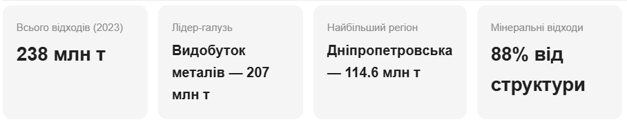
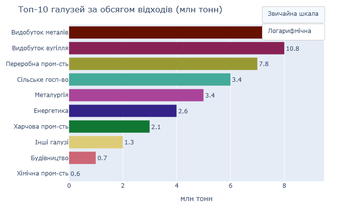

## Промислові відходи в Україні: масштаб, структура та порівняння з країнами ЄС

Джерела даних: Державна служба статистики України (ukrstat.gov.ua), Eurostat (env_wasgen, env_wastrt)  
Період аналізу:  2015–2024 (Україна), Eurostat
### 1. Постановка проблеми
Публічна дискусія про відходи в Україні зосереджена переважно на побутовому смітті — роздільному зборі, несанкціонованих звалищах і пластику. Проте побутові відходи становлять лише 2.3% від загального обсягу відходів країни. Основний обсяг утворюється в промисловому секторі і залишається поза увагою як широкої аудиторії, так і державної політики.
За даними Держстату, у 2023 році українські підприємства утворили 238 млн тонн відходів. Ця цифра охоплює лише задокументовану господарську діяльність і не включає будівельні відходи від зруйнованої внаслідок війни інфраструктури, обсяг якої станом на 2024 рік оцінюється в 10–30 млн тонн додатково.
## 2. Структура відходів України

### 2.1.   Галузева структура
Один сектор формує 86% усього обсягу: видобуток металевих руд генерує 206.5 млн тонн на рік. Це відходи гірничозбагачувальних комбінатів Криворізького басейну — хвости збагачення і розкривна порода. Решта десяти галузей разом дають 14%.

Серед менших галузей виділяється фармацевтична промисловість: за абсолютним обсягом вона генерує лише 0.9 тис. тонн небезпечних відходів, але це 7.5% від її загального виробництва — найвищий показник серед усіх галузей.

### 2.2 Матеріальна структура

88,4 % відходів за матеріальним складом — мінеральні. Побутові відходи, що домінують у публічному дискурсі, складають 2.3%.

.png)

### 2.3. Динаміка за 2015–2024 роки
Два різких падіння обсягів відходів у динаміці корелюють із двома ключовими подіями: 2014–2015 роки — окупація Донбасу і Криму, зупинка промислових підприємств на сході країни; 2022 рік — повномасштабне вторгнення, пошкодження і зупинка виробничих потужностей.

.png)

Обсяг відходів від видобутку металів у 2022 році скоротився з 366 до 170 млн тонн — прямий наслідок зупинки частини ГЗК.

### 2.4. Регіональна концентрація
Три регіони формують понад 60% загального обсягу: Дніпропетровська (114.6 млн т), Полтавська (23.1 млн т), Кіровоградська (21.7 млн т).

.png)

### 2.5. Небезпечні відходи
За часткою небезпечних відходів (клас I–III) лідирує Миколаївська область — 14.8% від регіонального обсягу. 

.png)

Серед галузей за абсолютним обсягом небезпечних відходів перше місце посідає переробна промисловість (44.7 тис. т). 
.png)

За часткою від галузевого обсягу — фармацевтика (7.5%).

.png)

## 3. Порівняння з країнами ЄС
### 3.1. Структура відходів: схожість не означає однакових результатів
Для коректного порівняння необхідно вибрати країни зі схожою з Україною структурою промислових відходів. Наприклад в Болгарії і Фінляндії гірничовидобуток формує значну частку загального обсягу, як і в Україні.

.png)

При схожій галузевій структурі підходи до поводження з відходами в цих країнах кардинально відрізняються.

 ### 3.2. Поводження з відходами по країнах ЄС
На графіку нижче відображено всі 27 країн ЄС і Україну, відсортовані за часткою захоронення на полігонах — від найменшої (лідери) до найбільшої (аутсайдери).

.png)

Швеція і Данія фактично відмовились від захоронення — менше 4% відходів потрапляють на полігони. Румунія і Болгарія захоронюють 93% і 88% відповідно — попри членство в ЄС з 2007 року. Україна з показником 40% знаходиться в середині списку, але методологія Держстату і Eurostat відрізняється, тому пряме порівняння потребує обережності.
Фінляндія виділена на графіку окремо: при розвиненій економіці вона має високу частку захоронення через домінування гірничих відходів у загальній структурі. Фінляндія є показовим прикладом країни, де загальна статистика маскує реальні досягнення. За показником частки захоронення вона опиняється поруч з Болгарією і Румунією — але причина принципово інша. Гірничовидобувні відходи, які технічно класифікуються як захоронення при поверненні у кар'єри, штучно завищують цей показник. Натомість за рівнем переробки побутових і промислових відходів Фінляндія входить до лідерів ЄС, а частка захоронення саме побутових відходів становить менше 1% — результат десятиліть послідовної політики і інвестицій понад 500 млн євро у програму CIRCWASTE. Це підтверджує, що загальна статистика без галузевого контексту може вводити в оману.
### 3.3. Членство в ЄС, регуляторні вимоги та державна політика
Визначення лідерів і аутсайдерів у сфері поводження з відходами в ЄС базується на директиві 2008/98/ЄС, яка встановлює ієрархію: запобігання → повторне використання → переробка → відновлення енергії → захоронення. Захоронення є найнижчим пріоритетом, тому країни з мінімальною часткою полігонного захоронення вважаються лідерами незалежно від структури їхньої економіки. Eurostat розраховує показники для всіх типів відходів разом, що створює методологічну проблему для країн з великою часткою гірничих відходів — таких як Фінляндія, Естонія і Україна. Тому при аналізі важливо розрізняти загальну статистику і показники для окремих секторів.18 з 27 країн-членів ЄС ризикують не виконати ціль переробки 55% до 2025 року. Болгарія переробляє 16.7% відходів — один з найгірших показників у союзі — попри 18 років членства. Це свідчить про те, що регуляторні вимоги самі по собі не є достатньою умовою для трансформації системи поводження з відходами.
Визначальними факторами є державна політика і обсяг інвестицій:
- Фінляндія реалізує Національний план поводження з відходами з бюджетом понад 502 млн євро.
- Болгарія лише у 2022–2027 роках запланувала інвестиції в 312.7 млн євро в рамках Стратегії циркулярної економіки.
- Україна прийняла Національний план управління відходами до 2033 року, проте реальний обсяг фінансування залишається несумірним із масштабом проблеми.

## 4. Економічний потенціал переробки
Поводження з відходами — це не лише екологічна, а й економічна проблема. Ринок управління відходами в Європі становив 394 млрд доларів у 2023 році, і 85% цього ринку формують саме промислові відходи.
Німеччина займає 24% європейського ринку управління відходами і досягла рівня переробки 69.1% — найвищого у світі серед великих економік. Провідні компанії галузі, зокрема Veolia, звітують про виручку понад 44 млрд євро на рік.
В Україні, за оцінками, лише 3–5% відходів реально потрапляють на переробку, хоча потенційно придатні для цього близько 20% від накопичених обсягів. Переробні підприємства змушені імпортувати вторинну сировину через відсутність організованої системи збору всередині країни.

## 5. Ініціативи України у сфері поводження з відходами
**Законодавча база.**
-У червні 2022 року Верховна Рада прийняла новий закон про управління відходами — першу системну реформу з часів незалежності, що набрав чинності у липні 2023 року і базується на директивах ЄС.
-Національний план до 2033 року. Документ передбачає охоплення щонайменше 85% населення послугами з управління відходами. Прийнятий як одна з рекомендацій Єврокомісії у звіті про прогрес України 2023 року.
-Переробка будівельних відходів. У 2024 році запущено пілотний проєкт у Київській області та п'яти містах — Одесі, Дніпрі, Харкові, Миколаєві і Херсоні. У Бородянці вже функціонує цикл переробки матеріалів для використання у дорожньому будівництві.
-Міжнародна підтримка. Шведська програма WM4U (2024–2027) спрямована на трансформацію муніципального управління відходами відповідно до стандартів ЄС. Проєкт ЄС LIFE-ZWC-UKRAINE (2024–2028) з бюджетом 1.1 млн євро підтримує чотири українські муніципалітети.
 ## 6. Висновки
1. Промислові відходи, а не побутові, є основною проблемою.86% обсягу формує один сектор — гірничовидобуток. Фокус публічної дискусії на побутовому смітті не відповідає реальній структурі проблеми.
2. Схожа структура економіки не визначає результат.  Україна, Болгарія і Фінляндія мають схожу частку гірничовидобувних відходів, але кардинально різні підходи до їх переробки. Це свідчить про те, що результат визначається не структурою економіки, а обсягом інвестицій і послідовністю державної політики.
3. Членство в ЄС є необхідною, але недостатньою умовою.  18 з 27 країн-членів не виконують власні цілі переробки. Болгарія — наочний приклад того, що регуляторна рамка без інвестицій не трансформує систему.
4. Законодавча база в Україні сформована, але не профінансована. Закон є, план є, міжнародна підтримка є. Відсутній масштаб інвестицій, достатній для системних змін.
5. Переробка промислових відходів є економічно обґрунтованою. Ринок об'ємом 394 млрд доларів у Європі переважно формується промисловим сектором. Україна з її обсягами відходів має значний потенціал, який наразі не реалізується.
6. Війна уповільнює будь-який прогрес. П'ятий рік повномасштабного вторгнення руйнує промислову інфраструктуру, скорочує обсяги виробництва і відповідно змінює структуру відходів, але головне — виснажує державні ресурси і відтягує інвестиційний потенціал від системних реформ. Реалізація Національного плану до 2033 року в умовах активних бойових дій потребує не лише внутрішньої політичної волі, а й стабільної міжнародної фінансової підтримки.

Джерела: 
Державна служба статистики України — ukrstat.gov.ua  
Eurostat — env_wasgen, env_wastrt (2022)  
Національна стратегія управління відходами України до 2030 року  
Eurostat Waste Statistics Report 2023  
Veolia Annual Report 2024

---

**Джерела:** Державна служба статистики України (ukrstat.gov.ua), Forbes Ukraine, НВ Бізнес, Національна стратегія управління відходами до 2030 року.
